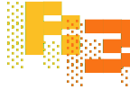

<p align="center">
  
</p>

<div align="center">

### Everything is a repo. Everything is an R3.

A universal, backend-agnostic CRUD repository abstraction for Go.

[](https://pkg.go.dev/github.com/amberpixels/r3)
[](https://github.com/amberpixels/r3/actions/workflows/go.yml)
[](go.mod)
[](LICENSE)

</div>

---

R3 (pronounced *"ree"* /riː/, as in **repo**) provides a single generic `CRUD[T, ID]`
interface that works identically across PostgreSQL, MySQL, SQLite, MongoDB,
JSON/YAML/TOML files, and any other data source. Your business code talks to
`r3.CRUD` - it never knows or cares what's behind it.

```go
// Same interface, same query, different backends
userRepo    r3.CRUD[User, int64]      // PostgreSQL via GORM
productRepo r3.CRUD[Product, string]  // MongoDB
configRepo  r3.CRUD[Config, string]   // YAML files on disk
```

> [!NOTE]
> R3 is in **early development** (pre-1.0). The core API is stable in spirit, but
> details may change before a tagged release. Questions, ideas, and feedback are
> very welcome - see [Feedback](#feedback).

## Contents

- [Why R3](#why-r3)
- [Install](#install)
- [Quick Start](#quick-start)
- [Architecture](#architecture)
- [Filters](#filters)
- [Schema & Capabilities](#schema--capabilities)
- [Pagination](#pagination)
- [Aggregation](#aggregation)
- [Upsert & Bulk Patch](#upsert--bulk-patch)
- [Relationships](#relationships)
- [Transactions](#transactions)
- [URL Query Parsing](#url-query-parsing)
- [Requirements](#requirements)
- [AI Disclosure](#ai-disclosure)
- [Feedback](#feedback)
- [License](#license)

## Why R3

R3 is **not** about swapping backends. Most systems pick a database and stick with it.

R3 is about the fact that real systems use **multiple** data sources: a relational DB
for core data, MongoDB for event logs, config files for feature flags, an external
REST API for third-party data. Without a shared interface, each one gets its own
query patterns, its own error handling, its own permission logic.

With R3, all of them speak the same language. More importantly, **features compose
across all of them**: wrap any repo with permissions, audit history, metrics, or
validation - regardless of what storage is behind it.

## Install

```bash
go get github.com/amberpixels/r3
```

Then pull in the driver(s) you need, e.g. `github.com/amberpixels/r3/drivers/gorm`.

## Quick Start

```go
import (
    "github.com/amberpixels/r3"
    r3gorm "github.com/amberpixels/r3/drivers/gorm"
)

// Define your model (standard GORM model)
type Pet struct {
    ID   int64  `gorm:"primaryKey"`
    Name string
}

// Create a repository
petRepo := r3gorm.NewGormCRUD[Pet, int64](db)

// Create
pet, err := petRepo.Create(ctx, Pet{Name: "Bella"})

// Get by ID - missing records return r3.ErrNotFound on every backend
pet, err := petRepo.Get(ctx, 42)
if errors.Is(err, r3.ErrNotFound) {
    // respond 404, etc.
}

// List with filters, sorting, and pagination.
// Short-form helpers (r3.Eq, r3.Gt, ...) keep simple filters terse.
pets, total, err := petRepo.List(ctx, r3.Query{
    Filters: r3.Filters{
        r3.Eq("name", "Bella"),
    },
    Sorts: r3.Sorts{
        r3.NewSortAscSpec(r3.NewFieldSpec("name")),
    },
    Pagination: r3.NewPaginationSpec(1, 25),
})

// Count matching records without materializing rows
n, err := petRepo.Count(ctx, r3.Query{Filters: r3.Filters{r3.Eq("name", "Bella")}})

// Update
pet.Name = "Max"
pet, err = petRepo.Update(ctx, pet)

// Patch (partial update - only specified fields)
pet, err = petRepo.Patch(ctx, pet, r3.Fields{r3.NewFieldSpec("name")})

// Delete
err = petRepo.Delete(ctx, 42)
```

## Architecture

R3 is organized in five layers. Each layer has a clear responsibility and depends
only on the layers above it.

```
r3 (core)           Interfaces + query model. Zero dependencies.
  |
  +-- dialects/     Pure converters: r3 types <-> format-specific representations.
  |                 No I/O, no state. Two categories:
  |                   Data-store:    sql, bson
  |                   Serialization: json, yaml, toml, url
  |
  +-- engine/       Complete CRUD implementations per storage category.
  |                 The heavy lifting lives here.
  |                   sql   - database/sql + reflection + Flavor
  |                   mongo - MongoDB driver + reflection
  |                   file  - filesystem + codecs + in-memory query eval
  |
  +-- drivers/      Ready-to-use constructors for specific libraries.
  |                   pq, pgx, mysql, sqlite3 - wrap engine/sql
  |                   gorm, bun, gopg         - ORM-native, share query prep
  |                   mongo                   - wraps engine/mongo
  |
  +-- features/     Composable decorators that wrap ANY r3.CRUD[T, ID].
                      permissions, history, metrics, validation,
                      i18n, softdelete, transactor
```

### Core (`r3` package)

The interfaces and query model. This is the contract everything else implements.

**Interfaces:**
- `CRUD[T, ID]` - Full read+write repository (composes Querier + Commander)
- `Querier[T, ID]` - Read-only: `Get`, `List`, `Count`
- `Commander[T, ID]` - Write-only: `Create`, `Update`, `Patch`, `Delete`
- `Transactor[T, ID]` - Opt-in transaction support: `BeginTx`

**Query model** - a single composable `Query` struct:
- `Filters` - Field-operator-value conditions with recursive AND/OR groups
- `Sorts` - Multi-column sort with direction and NULLS FIRST/LAST
- `PaginationSpec` - Page number + size, or a raw `(offset, limit)`
- `CursorSpec` - Keyset/cursor-based (forward/backward with opaque tokens)
- `Fields` - Column selection (SELECT specific fields)
- `Preloads` - Eager loading of related entities

Queries are immutable values. `MergeWith()` combines queries from different sources
(e.g. defaults + user request + permission scope) without mutation.

### Dialects

Stateless, bidirectional converters between r3 types and format-specific representations.

**Data-store dialects** convert r3 queries into storage-native primitives:
- `dialects/sql` - `FilterSpec` -> `WHERE status = ? AND age > ?` with parameterized args
- `dialects/bson` - `FilterSpec` -> `bson.D{{Key: "status", Value: "active"}}`

**Serialization dialects** convert r3 queries to/from interchange formats:
- `dialects/json` - REST API request/response bodies
- `dialects/yaml` - Configuration files
- `dialects/toml` - Configuration files
- `dialects/url` - URL query parameters (`?sort=name:asc&page=2&status=active`)
- `dialects/when` - human time vocabulary (`"weekends"`, `"mornings"`) into
  recurring time-pattern filters, bridging [years](https://github.com/amberpixels/years)

Engines and drivers consume dialects internally; most application code never
imports them directly.

### Engines

Complete `r3.CRUD` implementations for a **category** of storage backend.
Each engine handles reflection, query building, and execution for its storage type.

- `engine/sql` - Generic SQL via `database/sql`. Uses `Flavor` to handle
  differences between Postgres ($1 placeholders, RETURNING), MySQL (? placeholders,
  LAST_INSERT_ID), and SQLite. Provides `BaseCRUD[T, ID]` that raw SQL drivers embed,
  and `PreparedListQuery` that ORM drivers share for filter/sort/pagination translation.

- `engine/mongo` - MongoDB via the official Go driver v2. Handles BSON document
  building, projection, cursor pagination, relation preloading via separate queries.

- `engine/file` - Filesystem-based storage with pluggable codecs (JSON, YAML).
  Applies filters, sorts, and pagination in-memory. Supports single-file
  (one JSON per collection) and directory (one file per entity) modes.

### Drivers

Ready-to-use constructors that wire up an engine for a specific client library.

**Raw SQL drivers** (embed `engine/sql.BaseCRUD`):

| Driver | Package | Library | Notes |
|--------|---------|---------|-------|
| PostgreSQL | `drivers/pq` | [lib/pq](https://github.com/lib/pq) | `$1` placeholders, RETURNING |
| PostgreSQL | `drivers/pgx` | [jackc/pgx](https://github.com/jackc/pgx) | `$1` placeholders, RETURNING |
| MySQL | `drivers/mysql` | [go-sql-driver/mysql](https://github.com/go-sql-driver/mysql) | `?` placeholders, no RETURNING |
| SQLite | `drivers/sqlite3` | [mattn/go-sqlite3](https://github.com/mattn/go-sqlite3) | `?` placeholders, RETURNING (3.35+) |

**ORM drivers** (use ORM API natively, share `PreparedListQuery` for query translation):

| Driver | Package | Library | Preloads | Soft-delete |
|--------|---------|---------|----------|-------------|
| GORM | `drivers/gorm` | [gorm.io/gorm](https://github.com/go-gorm/gorm) | Preload() | Unscoped() |
| Bun | `drivers/bun` | [uptrace/bun](https://github.com/uptrace/bun) | Relation() | WhereAllWithDeleted() |
| go-pg | `drivers/gopg` | [go-pg/pg/v10](https://github.com/go-pg/pg) | Relation() | AllWithDeleted() |

**NoSQL drivers:**

| Driver | Package | Library |
|--------|---------|---------|
| MongoDB | `drivers/mongo` | [mongo-driver/v2](https://github.com/mongodb/mongo-go-driver) |

All drivers expose a `Raw()` escape hatch for queries that go beyond the r3 interface.

### Features (Decorators)

Composable middleware that wraps **any** `r3.CRUD[T, ID]`, regardless of backend.
This is where R3's "everything is a repo" philosophy pays off - the same
permission logic works for your Postgres entities and your MongoDB logs.

```go
// Stack features via decoration:
repo := permissions.WithPermissions(
    history.WithHistory(
        validation.WithValidation(
            r3gorm.NewGormCRUD[Order, int64](db),
            orderValidator,
        ),
        historyStore, history.WithIDFunc[Order, int64](func(o Order) int64 { return o.ID }),
    ),
    orderPermissions,
)
// repo is still r3.CRUD[Order, int64] - fully transparent
```

**Available features:**

- **permissions** - Policy-based authorization. Gates every CRUD operation through a
  user-defined `Checker`. Supports entity-aware row-level checks and scope injection
  (automatic filter injection into List queries). Bring your own auth logic.
  Also advertises verdicts (`Allow`/`AllowedOps`) so a frontend can render per-row
  capability flags computed by the same policy that enforces - no client-side drift.

- **history** - Change tracking / audit log. Records every mutation as a `ChangeRecord`
  with field-level diffs. Supports snapshots, revert-to-version, and tree queries.
  The history store is itself an `r3.CRUD[ChangeRecord, string]`.

- **metrics** - Domain-level analytics. 10 built-in collectors (action counts, latency,
  popularity, error rates, etc.). Configurable time bucketing, aggregation, and retention.
  The metrics store is itself an `r3.CRUD[MetricRecord, string]`.

- **validation** - Pre-mutation validation. Bring your own validator
  (go-playground/validator, ozzo-validation, plain Go). Patch-aware and
  state-transition-aware (can compare new vs existing entity).

- **i18n** - Entity-content translations. Reads (Get/List) overlay translated
  field values for the locale carried in the context (`r3.WithLocale`); writes
  mark translations of changed source text stale for re-translation workers.
  The translation store is itself an `r3.CRUD[Translation, string]`.

- **softdelete** - Adds `Restore()` and `HardDelete()` to any CRUD that supports soft-delete.

- **transactor** - Surfaces transaction capabilities (`BeginTx`, `InTx`) from the
  underlying driver.

## Filters

Build filters with the short-form helpers (a plain field name) for the common
case, or drop down to the `FieldSpec`-based forms when you need table hints or
nested paths:

```go
// Short-form helpers - terse, take a plain field name
r3.Eq("status", "active")
r3.Gt("age", 18)
r3.In("country", []string{"DE", "FR"})
r3.Like("name", "%john%")
r3.ILike("name", "%john%")
r3.Between("price", 10, 100)        // inclusive

// FieldSpec forms - for table hints / nested paths
r3.F(r3.NewFieldSpec("status"), "active")
r3.Fop(r3.NewFieldSpec("age"), r3.OperatorGte, 18)

// Logical groups (compose either form)
r3.And(
    r3.Eq("status", "active"),
    r3.Gte("age", 18),
)

r3.Or(
    r3.Eq("role", "admin"),
    r3.Eq("role", "moderator"),
)

// NULL checks (nil value + Eq/Ne operator)
r3.Eq("deleted_at", nil)  // IS NULL
```

**Available operators:** `Eq`, `Ne`, `Gt`, `Gte`, `Lt`, `Lte`, `In`, `NotIn`,
`Like`, `NotLike`, `ILike`, `Between`, `BetweenEx`, `BetweenExInc`, `BetweenIncEx`, `Exists`,
`WeekdayIn`, `TimeOfDayBetween`.

### Recurring time patterns

Two operators match a time field against a *recurring* weekly wall-clock pattern -
something no `Between`/`In` combination can express, because a recurring window
over a timestamp column is an infinite union of ranges:

```go
r3.WeekdayIn("started_at", time.Saturday, time.Sunday)  // weekend rows
r3.TimeOfDayBetween("started_at", 22*60, 5*60)          // 22:00-05:00 (wraps midnight)
```

Both evaluate the field's **stored wall-clock value as-is** - no engine performs
timezone conversion. Apps that need per-row locality store a local wall-clock
column and filter on that. Store UTC (or a normalized local wall-clock) for
identical results across backends: the in-memory engines read the `time.Time`'s
own location while Mongo reads the stored date as UTC. The keyword vocabulary
that turns `"weekends"` or `"mornings"` into these operators lives in the
[`dialects/when`](dialects/when) bridge to
[years](https://github.com/amberpixels/years), never in the core:

```go
filters, err := r3when.Parse("started_at", "weekends,mornings")  // OR of the two
```

Backend support: the file engine and Mongo execute these operators today (Mongo
lowers them to an indexless `$expr`); the SQL dialect returns a loud error until
per-flavor weekday/hour extraction lands (see `docs/plan-when-filters.md`).

## Schema & Capabilities

`r3.SchemaOf[T]()` reflects an entity's struct tags into a **`Schema`** - an
ordered set of capability-bearing **`Attribute`s**. Each attribute declares what
it may do via five capabilities: `Filterable`, `Sortable`, `Queryable` (select &
output), `Creatable`, and `Mutable`. Defaults are permissive - a plain scalar
column gets all five - and tags only ever *tighten* them:

```go
type Pet struct {
    ID        int64     `r3:"id,pk"`                              // read-only identity
    Name      string    `r3:"name"`                               // all capabilities
    Status    string    `r3:"status,enum:available|pending|sold"` // enum + allowed values
    Slug      string    `r3:"slug,immutable"`                     // creatable once, then read-only
    Visits    int       `r3:"visits,readonly"`                    // system-tracked; users can't write
    VetNotes  string    `r3:"vet_notes,no-filter,no-sort,no-output"` // hidden everywhere
    CreatedAt time.Time `r3:"created_at"`                         // server-managed (read-only)
}
```

The SQL engines consume the schema automatically:

- **Reads are validated.** An unknown or disallowed filter/sort/select field
  becomes a typed error *before any SQL runs* - `ErrUnknownField`,
  `ErrFieldNotFilterable`, `ErrFieldNotSortable`, `ErrFieldNotQueryable` - instead
  of a backend 500. Each error wraps the offending field name.
- **Writes are shaped.** `Create` writes only `Creatable` columns; `Update`/`Patch`
  write only `Mutable` columns. A full `Update` can no longer clobber `created_at`
  or resurrect a soft-deleted row. The `created_at`/`updated_at` timestamps are
  *system-managed*: the engine stamps them with server time (read-only to callers,
  written by the system), so `created_at` is set on create and `updated_at` bumps
  on every write.

Capabilities are the **public ceiling**: the `permissions` feature only narrows
them per-actor/row, never widens. For an audited system/worker write of a
user-immutable column (e.g. a nightly inventory sync), open the explicit door - it
skips only the capability check, never the structural floor (the PK and computed
attributes stay unwritable), and the write still passes through `history`/`metrics`:

```go
r3.SystemWriter(repo).Update(ctx, syncedPet)        // ergonomic wrapper
repo.Update(r3.WithoutWriteGuard(ctx), syncedPet)   // or the raw context marker
```

A schema serializes to a stable, public-only JSON shape via
`dialects/schema.MarshalSchema` (non-queryable attributes are omitted), so a
consumer can describe an entity to a frontend for column pickers and a dynamic
filter UI.

## Pagination

**`List` paginates by default** - with no `Pagination` set it caps results at
`r3.PageSizeDefault` (100), so a forgotten pagination never accidentally scans a
whole table. There are three ways to get more:

```go
// 1. A custom page / size, per query
r3.Query{Pagination: r3.NewPaginationSpec(1, 250)}  // page 1, 250 per page

// 2. Everything, for this one query (clears the default cap)
all, total, err := repo.List(ctx, r3.Query{Pagination: r3.Unpaginated()})

// 3. Everything by default, for this repo (global opt-out)
repo := r3gorm.NewGormCRUD[Pet, int64](db,
    r3.WithConfig(r3.Config{Defaults: r3.DefaultsConfig{Unpaginated: true}}),
)
// repo.List(ctx) now returns all rows; individual queries can still paginate.
```

Consumers that think in raw row offsets (REST `?offset=`, infinite-scroll
loaders) can skip the page-number math and pass an offset directly. Unlike a page
number, an offset can start at a row that is not a multiple of the limit - it is
carried to the driver verbatim, so no rounding silently duplicates or skips rows:

```go
r3.Query{Pagination: r3.NewOffsetPagination(100, 30)}  // exactly rows 100-129
```

Cursor-based pagination is the alternative to offset (requires at least one sort):

```go
r3.Query{
    Cursor: r3.NewCursorAfter(nextToken, 25),
    Sorts:  r3.Sorts{r3.NewSortDescSpec(r3.NewFieldSpec("created_at"))},
}
```

## Aggregation

Grouped `COUNT`/`COUNT DISTINCT`/`SUM`/`AVG`/`MIN`/`MAX` without materializing
rows, via the opt-in `Aggregator` capability. Declare the shape on the query
(`GroupBy`, `Aggregates`, `Having`) and call it through `r3.AggregateOf`:

```go
// Order stats per store: how many, and when the latest one was placed.
rows, err := r3.AggregateOf(ctx, orderRepo, r3.Query{
    Filters: r3.Filters{r3.Ne("store_id", nil)},
    GroupBy: r3.GroupBy("store_id", "status"),
    Aggregates: r3.Aggregates{
        r3.AggCount("orders"),
        r3.AggMax("placed_at", "last_order"),
    },
    Having: r3.Filters{r3.Gt("orders", 1)},          // filters grouped rows by alias
    Sorts:  r3.Sorts{r3.NewSortDescSpec(r3.NewFieldSpec("orders"))},
})
for _, row := range rows {
    store, _ := row.Int64("store_id")
    n, _ := row.Int64("orders")
    last, _ := row.Time("last_order") // parses backends' textual timestamps too
    fmt.Printf("store %d: %d orders, last on %s\n", store, n, last.Format(time.DateOnly))
}
```

Each `AggregateRow` carries the group-field values plus one entry per declared
alias; the typed accessors (`Int64`, `Float64`, `String`, `Time`, `Bool`)
coerce backend-native representations (SQLite returns `MAX` over a datetime as
TEXT, MySQL returns `SUM` as a decimal string). `Filters`, `IncludeTrashed`,
`Sorts` (over group fields and aliases), and `Pagination` (limits grouped rows)
apply; an empty `GroupBy` returns a single whole-set row.

Every engine implements `Aggregator` - SQL lowers to `GROUP BY`/`HAVING`, Mongo
runs a `$group` pipeline, the file engine folds in memory - and every feature
decorator forwards it, with permissions applying its scope filters so grouped
results only ever cover rows the actor may see. `r3.AggregateOf` deliberately
checks only the outermost repo (never unwrapping decorators), so that scoping
cannot be bypassed. A repo without the capability returns
`r3.ErrAggregateNotSupported`.

## Upsert & Bulk Patch

Two more opt-in write capabilities, reached through top-level helpers (like
`r3.AggregateOf`) so feature decorators - permission scoping in particular -
always apply:

```go
// Upsert - insert, or update in place on conflict. With no options it
// conflicts on the primary key and overwrites every mutable column.
pet, err := r3.UpsertOf(ctx, petRepo, pet,
    r3.OnConflict("slug"),                        // custom conflict target
    r3.UpdateOnConflict(r3.NewFieldSpec("name")), // overwrite only these columns
)

// PatchWhere - set fields (taken from the entity) on every row matching
// the filters; returns the number of rows affected.
n, err := r3.PatchWhereOf(ctx, petRepo,
    r3.Filters{r3.Eq("status", "pending")},
    Pet{Status: "available"},
    r3.Fields{r3.NewFieldSpec("status")},
)
```

A backend without the capability returns `r3.ErrUpsertNotSupported` /
`r3.ErrBulkPatchNotSupported`: upsert is implemented by the GORM, raw SQL,
Mongo, and Bun drivers; bulk patch by GORM, raw SQL, and Mongo. See
[`docs/backend-parity.md`](docs/backend-parity.md).

## Relationships

Entities relate to each other as **has-many**, **belongs-to**, or
**many-to-many**. Declare a relation by struct tag
(`r3:"rel:has-many,fk:store_id"`) or physically by table and column names - the
latter lets an entity relate to a table it does not import as a Go type, which
sidesteps domain import cycles:

```go
// Pet relates to tags via a join table - with no Tags field on Pet,
// so package pet never imports package tag.
repo := r3gorm.NewGormCRUD[Pet, int64](db, r3.WithRelations(
    r3.ManyToManyRelation("tags", "pet_tags", "pet_id", "tag_id", "tags"),
))
```

Either way the relation drives three operations:

```go
// Has - rows whose relation matches (EXISTS)
repo.List(ctx, r3.Query{Filters: r3.Filters{r3.Has("tags", r3.Eq("name", "vaccinated"))}})

// HasNo - the anti-join (NOT EXISTS): rows with no matching related row,
// correctly including rows whose foreign key is NULL
repo.List(ctx, r3.Query{Filters: r3.Filters{r3.HasNo("orders")}})

// AggregateThroughRelation - grouped aggregation over the related rows
// (a has-many child table or an m2m join table)
rows, _ := r3.AggregateThroughRelation(ctx, storeRepo, "pets", r3.Query{
    GroupBy:    r3.GroupBy("store_id"),
    Aggregates: r3.Aggregates{r3.AggCount("pets")},
})
```

`AggregateThroughRelation` interprets `Filters` as owner filters (so a
permissions `Scoper` restricts which owners' related rows are folded) and
excludes soft-deleted related rows when the relation declares a soft-delete
column. It is reached via the `RelationAggregator` capability, forwarded by
every decorator like `Aggregator`.

**Backend support:** relation resolution (`Has`/`HasNo`/`AggregateThroughRelation`)
is implemented by the GORM and Mongo drivers today; other backends reject or ignore it. See
[`docs/backend-parity.md`](docs/backend-parity.md) for the tracked gap list.

## Transactions

```go
err := r3.InTx(ctx, repo, func(tx r3.CRUD[Order, int64]) error {
    order, err := tx.Create(ctx, newOrder)
    if err != nil {
        return err // auto-rollback
    }
    // ... more operations within the same transaction
    return nil // auto-commit
})
```

## URL Query Parsing

Parse HTTP request parameters directly into r3 queries:

```go
import r3url "github.com/amberpixels/r3/dialects/url"

// GET /api/pets?fields=id,name&sort=name:asc&page=2&page_size=25&status=available
q, err := r3url.ParseQuery(r.URL.Query(),
    r3url.WithDjangoStyleFilters("status", "name"),
)
pets, total, err := petRepo.List(ctx, q)
```

Opt in to `?when=` recurring time-pattern filters (see
[Recurring time patterns](#recurring-time-patterns)) by pinning the target time
column. An unknown keyword is a client error, surfaced with the list of valid
terms:

```go
// GET /api/sessions?when=weekends
q, err := r3url.ParseQuery(r.URL.Query(),
    r3url.WithWhenFilter("started_at"),
)
```

## Requirements

- Go 1.26+

## AI Disclosure

R3's code is written with heavy AI assistance - and that's by design. But the AI
is a tool here, not the author of record:

- **Every architectural decision is made by a human.** The layering, the
  interfaces, the trade-offs - those are deliberate human choices, not whatever
  a model happened to produce.
- **Every line of code is read and reviewed by a human before it's pushed.**
  Nothing lands in this repository unread.
- **The code is written AI-first.** It's deliberately optimized to be easy for AI
  to read, grep, update, and extend - not primarily for human ergonomics. Clear,
  greppable names and consistent structure win over cleverness.

Responsibility for the code is human. 🤖🤝🧑

## Feedback

R3 is a solo, opinionated project - but if you stumbled upon it and have
ideas, questions, or bug reports, an [issue](https://github.com/amberpixels/r3/issues) is always welcome :)

## License

[MIT](LICENSE) © [amberpixels](https://amberpixels.io)
